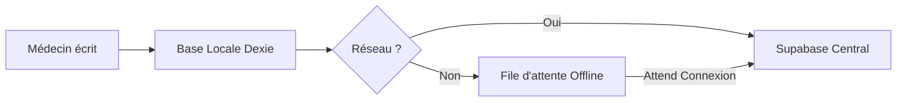

# SmartClinic — Le Coeur Technologique (V1.0)

Ce document explique comment SmartClinic fonctionne, du point de vue d'un **administrateur** (pour la vision) et d'un **développeur** (pour l'action).

---

## 1. La Vision SmartClinic : "L'Excellence Médicale Digitale"

SmartClinic n'est pas qu'un logiciel ; c'est un **registre numérique infalsifiable** et un **pass santé universel** conçu pour la Guinée.

### Les 3 Garanties Fondamentales :
1.  **Disponibilité (Offline)** : La clinique ne s'arrête pas quand Internet tombe.
2.  **Sécurité (Audit)** : Chaque regard porté sur un dossier est tracé.
3.  **Survie (Emergency)** : Un simple scan QR sauve des vies en situation critique.

---

## 2. Comment ça marche ? (L'Architecture Simplifiée)

Pensez à SmartClinic comme à un **Cerveau Central** (le Serveur) et des **Registres Locaux** (les Appareils de la clinique).

### A. Le Cerveau Central (Supabase)
Il stocke tout de manière sécurisée : l'identité des médecins, les dossiers patients et les photos (radios, ordonnances). Il gère aussi l'envoi automatique des SMS de rappel via Africa's Talking.

### B. Le Registre Local (Offline Engine - Dexie.js)
Chaque ordinateur ou tablette garde sa propre copie des données essentielles. Si la connexion est coupée, vous continuez à travailler. Dès que le réseau revient, le "Registre Local" parle au "Cerveau Central" pour se mettre à jour sans doublons.

### C. Le Portail d'Urgence (La Clé QR)
C'est la partie publique du système. Elle ne montre QUE ce qui est vital (sang, allergies). C'est comme une **étiquette médicale de secours** qui ne s'ouvre qu'avec le QR Code du patient.

---

## 3. Les Flux Critiques (Pour les Experts)

Voici comment les données voyagent dans le système.

### Flux de Synchronisation (La Résilience)

### Le Mur de Sécurité (RBAC - Role Based Access Control)
Chaque utilisateur a un badge numérique :
- **Médecin** : Peut voir/écrire les dossiers médicaux.
- **Réception** : Peut gérer les RDV et créer des patients, mais NE PEUT PAS lire un diagnostic.
- **Admin** : Gère le système mais ne voit pas les données de santé.
- **Patient** : Ne voit que sa propre "Carte Santé".

---

## 4. Dictionnaire Technique (Le Registre de Données)

### Tables PostgreSQL (Le Classement)
- **`clinics`** : Les "Murs" de l'établissement (Nom, Adresse à Conakry).
- **`patients`** : L'ID unique (`patient_number`) et le `qr_token` (la clé d'accès).
- **`medical_records`** : Le journal de bord des consultations (Diagnostics, Traitements).
- **`audit_logs`** : La "Boîte Noire" (Qui a fait quoi, quand et depuis quelle IP ?).

---

## 5. Guide de Maintenance (Pour le Futur)

### Identifiants de Test (Mode Démonstration)

Utilisez ces comptes pour explorer les différents badges numériques de la plateforme :

| Rôle | Email | Mot de passe |
| :--- | :--- | :--- |
| **Administrateur** | `admin@smartclinic.gn` | `Admin2025!` |
| **Médecin** | `doctor@smartclinic.gn` | `Dr2025!` |
| **Réceptionniste** | `reception@smartclinic.gn` | `Rec2025!` |
| **Patient (Mamadou)** | `patient@smartclinic.gn` | `Pat2025!` |

---
*SmartClinic — Pensé pour la performance, conçu pour la Guinée.*
